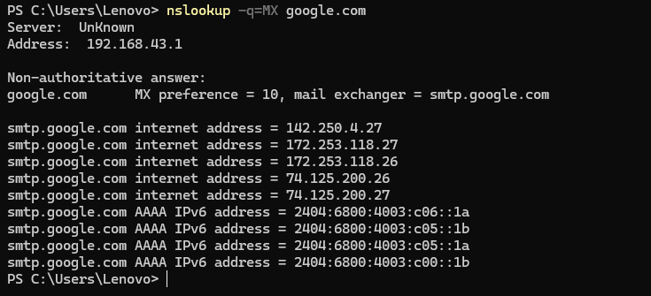
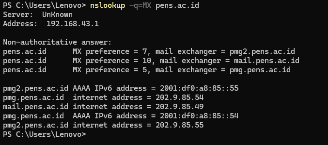

# Ringkasan Mail Server

## Apa Itu Protokol Mail?

Protokol mail adalah seperangkat aturan yang menjadi dasar dalam proses pengiriman, penerimaan, serta pengelolaan email dalam jaringan. Tiga protokol paling umum yang digunakan adalah:
- `SMTP` (Simple Mail Transfer Protocol)
- `IMAP` (Internet Message Access Protocol)
- `POP3` (Post Office Protocol versi 3)

Terdapat juga varian aman dari POP3, yaitu `POP3S`, yang memanfaatkan enkripsi.

---

### SMTP – Simple Mail Transfer Protocol

**Tujuan utama** dari SMTP adalah mengatur proses pengiriman email, baik dari pengguna ke server maupun antar server.

**Port yang digunakan secara umum**:
- Port 25 → standar, tanpa enkripsi
- Port 587 → menggunakan STARTTLS untuk keamanan
- Port 465 → memakai SSL/TLS (aman)

**Jenis protokol**: bersifat *push*, hanya untuk mengirim, bukan menerima.

**Bagaimana prosesnya berlangsung?**
1. Pengguna menulis dan mengirim email lewat aplikasi klien.
2. Pesan dikirim ke SMTP server.
3. Server mengirimkan email ke server tujuan.
4. Email diambil oleh penerima menggunakan protokol POP3 atau IMAP.

---

### POP3 – Post Office Protocol versi 3

**Fungsi utamanya** adalah mengambil pesan dari server dan menyimpannya di perangkat pengguna.

**Port yang biasa digunakan**:
- Port 110 (tidak dilengkapi enkripsi)

**Karakteristik umum**:
- Merupakan protokol *pull* yang menggunakan metode *store-and-forward*.
- Setelah diunduh, email biasanya dihapus dari server.
- Tidak memungkinkan sinkronisasi antar perangkat.
- Paling cocok untuk penggunaan di satu perangkat saja.

---

### IMAP – Internet Message Access Protocol

**Peran utamanya** adalah menyediakan akses langsung ke email yang tersimpan di server.

**Port default yang digunakan**:
- Port 143 → koneksi tanpa enkripsi
- Port 993 → koneksi aman melalui SSL/TLS

**Kelebihan protokol ini**:
- Mendukung sinkronisasi dua arah (dua arah antara klien dan server).
- Email tetap berada di server meskipun dibaca atau diubah.
- Ideal untuk pengguna dengan banyak perangkat.

---

### POP3S – POP3 Secure

**POP3S** adalah versi aman dari POP3 yang menggunakan protokol enkripsi SSL/TLS.

**Port yang digunakan**:
- Port 995

**Apa keuntungannya?**
- Data yang ditransfer dienkripsi, sehingga lebih aman terutama ketika menggunakan jaringan publik.

---

### Perbandingan SMTP, POP3, POP3S, dan IMAP

| Fitur                        | SMTP             | POP3             | POP3S               | IMAP                 |
|------------------------------|------------------|------------------|---------------------|----------------------|
| Fungsi utama                 | Kirim email      | Ambil email      | Ambil email aman    | Akses & kelola email |
| Port default                 | 25 / 587 / 465   | 110              | 995                 | 143 / 993            |
| Arah komunikasi              | Client → Server  | Server → Client  | Server → Client     | Server ↔ Client      |
| Sinkronisasi multi-perangkat| ✗                | ✗                | ✗                   | ✓                    |
| Email tetap di server        | ✗                | ✗ (umumnya)      | ✗ (umumnya)         | ✓                    |
| Enkripsi                     | Opsional         | ✗                | ✓                   | ✓ (di port 993)      |
| Kesesuaian penggunaan        | Pengiriman       | Satu perangkat   | Aman di satu perangkat| Banyak perangkat   |

---

## Mengetahui Mail Server pada Domain

`MX Record` (Mail Exchange Record) adalah entri dalam DNS yang menetapkan server tujuan untuk menerima email pada suatu domain.

Untuk mengetahui mail server milik sebuah domain, kita dapat menggunakan perintah berikut:

```bash
nslookup -q=MX [domain]
```

**Contoh penggunaan:**

- `google.com`

  

  Hasil perintah menunjukkan bahwa salah satu Mail Exchanger milik Google adalah `smtp.google.com`.

- `pens.ac.id`

  

  Dari hasil di atas terlihat bahwa domain `pens.ac.id` memiliki tiga Mail Exchanger:
  - `pmg2.pens.ac.id`
  - `mail.pens.ac.id`
  - `pmg.pens.ac.id`

---

## Pengenalan Email secara Umum


### Komponen Utama Email

1. **Alamat Email**  
   Identifikasi unik pengguna dalam format seperti `nama@domain.com`.

2. **Email Client**  
   Aplikasi yang digunakan untuk membaca dan menulis email, seperti Outlook, Thunderbird, atau Gmail.

3. **Email Server**  
   Tempat penyimpanan email yang juga berfungsi sebagai perantara dalam proses pengiriman dan penerimaan.

---

### Bagaimana Email Dikirim?

1. Pengguna membuat email melalui klien.
2. Menambahkan alamat penerima di kolom tujuan.
3. Menuliskan subjek untuk mendeskripsikan isi email.
4. Menyusun isi pesan.
5. Melampirkan file jika dibutuhkan.
6. Tekan tombol "Send" dan pesan dikirimkan ke server.

---

## Struktur Sistem Email

1. **User Agent (UA)**  
   Perangkat lunak yang digunakan untuk menulis, membaca, dan mengelola email.

2. **Message Transfer Agent (MTA)**  
   Komponen yang bertugas untuk mentransfer email dari satu sistem ke sistem lain, menggunakan protokol seperti SMTP.

3. **Mailbox**  
   Lokasi tempat menyimpan email yang sudah diterima.

4. **Spool File**  
   Tempat penyimpanan sementara email yang akan dikirim. UA menempatkan pesan di sini sebelum dikirim oleh MTA.

---

### Alur Kerja Pengiriman Email

1. Pengguna mengirim email melalui User Agent.
2. Email ditempatkan sementara di spool.
3. Alamat email diperiksa oleh Alias Expander, mungkin dimodifikasi sesuai database.
4. Email dilanjutkan ke MTA klien.
5. MTA mengirim email melalui jaringan ke MTA milik penerima.
6. MTA penerima menyerahkan email ke Alias Expander untuk diproses.
7. Email disimpan dalam mailbox milik penerima.
8. Penerima bisa membuka email dari User Agent miliknya.
