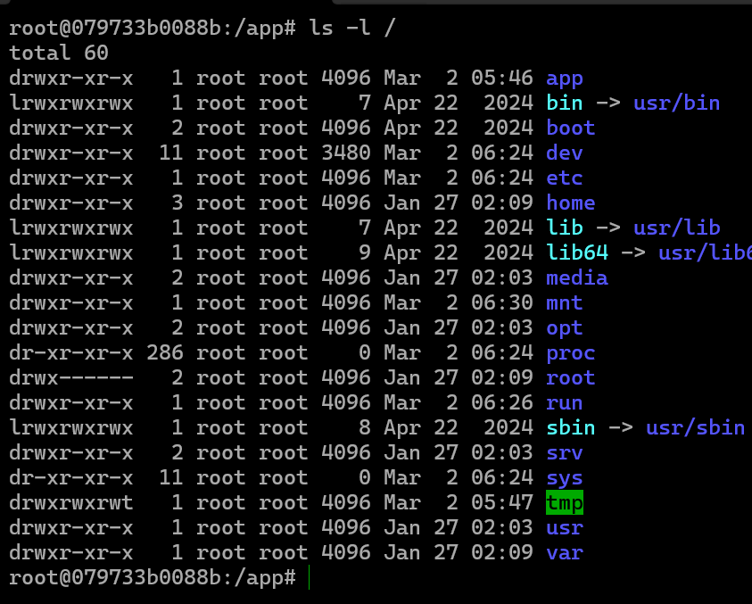
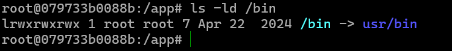
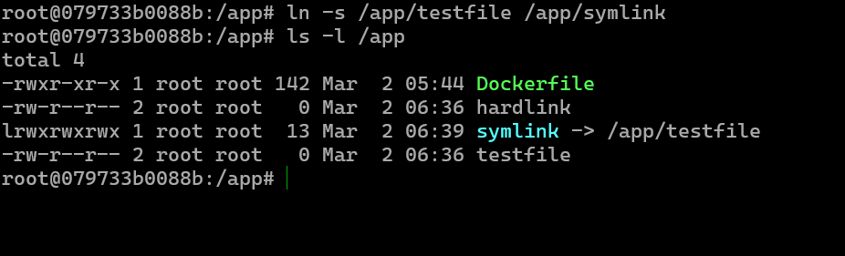
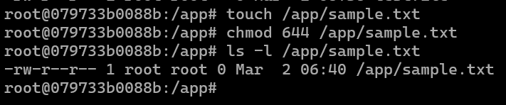
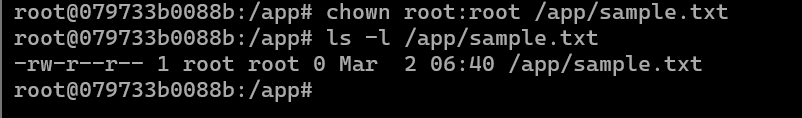
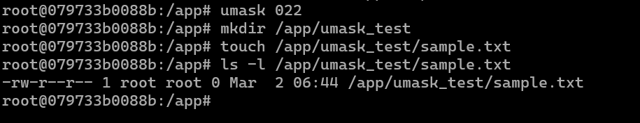
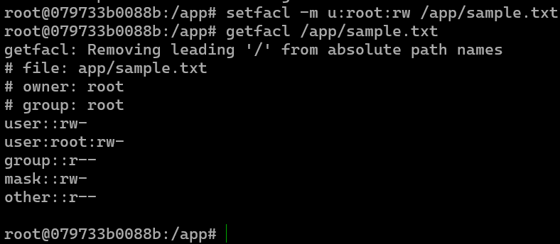

# File System
# Tugas Analisis File System

## Administrasi Jaringan

**Tugas Analisis File System**

**Nama:** Muhammad Zaidan Zhafiz Satrianto  
**NRP:** 3123600021  
**Kelas:** D4 IT A  

---

## Menampilkan Path Direktori


Perintah `pwd` digunakan untuk mengetahui lokasi direktori saat ini. Pada contoh ini, direktori kerja aktif berada di dalam folder `app`.


Perintah `ls` digunakan untuk melihat isi suatu direktori. Misalnya, `ls /home` akan menampilkan daftar file dan folder yang ada di dalam direktori `home`.

---

## Melihat Struktur Direktori Root



Untuk menampilkan struktur utama direktori, gunakan perintah berikut:
```bash
ls -l /
```
Perintah ini akan menampilkan daftar file dan folder dalam direktori root (`/`), lengkap dengan informasi izin akses, pemilik, grup, ukuran, serta detail lainnya.

---

## Menentukan Jenis File



Perintah `file` berguna untuk mengetahui jenis suatu file. Contoh penggunaannya:
```bash
file /bin/bash
```
Hasil yang ditampilkan akan menunjukkan apakah file tersebut berupa binary, script, atau format lainnya. Perintah ini sangat membantu dalam mengidentifikasi tipe file sebelum digunakan atau dimodifikasi.

---

## Membuat dan Menggunakan Hard Link


Hard link dibuat menggunakan perintah `ln`. Contohnya:
```bash
ln /etc/passwd /tmp/passwd_hardlink
```
Hard link memungkinkan beberapa nama file mengacu pada satu inode yang sama dalam sistem file. Fitur ini berguna agar file tetap dapat diakses meskipun file aslinya dihapus. Namun, hard link hanya dapat dibuat dalam satu sistem file yang sama.

---

## Membuat dan Menggunakan Symbolic Link



Symbolic link atau soft link dibuat dengan perintah `ln -s`. Contoh penggunaan:
```bash
ln -s /etc/passwd /tmp/passwd_symlink
```
Berbeda dengan hard link, symbolic link hanya berupa referensi ke lokasi file asli. Kelebihannya, symbolic link dapat menunjuk ke file di sistem file yang berbeda dan tetap berfungsi meskipun file asli dipindahkan atau dihapus.

---

## Mengubah Izin File



Perintah `chmod` digunakan untuk mengatur izin akses file. Contoh:
```bash
chmod 644 /app/sample.txt
```
Dengan perintah ini, pemilik file mendapatkan izin baca dan tulis (`rw-`), sementara pengguna lain hanya dapat membaca (`r--`). Pengaturan izin seperti ini penting dalam mengelola akses file di lingkungan multi-user.

---

## Mengubah Kepemilikan File



Untuk mengubah kepemilikan file, gunakan perintah `chown`. Contoh:
```bash
chown root:root /app/sample.txt
```
Perintah ini memastikan hanya pengguna atau grup tertentu yang memiliki kontrol penuh terhadap file, yang sangat penting dalam sistem dengan banyak pengguna.

---

## Menggunakan Perintah umask



Perintah `umask` digunakan untuk menentukan izin default saat membuat file atau folder baru. Contoh penggunaannya:
```bash
umask 022
mkdir /app/newdir
ls -ld /app/newdir
```
Dengan `umask 022`, direktori yang dibuat akan memiliki izin `755`, artinya pemilik bisa membaca, menulis, dan mengeksekusi, sedangkan pengguna lain hanya bisa membaca dan mengeksekusi. Hal ini berguna untuk mengontrol pengaturan izin file secara sistematis.

---

## Menggunakan ACL untuk Mengatur Hak Akses File



Untuk pengelolaan izin yang lebih fleksibel, gunakan perintah `setfacl` dan `getfacl`. Contohnya:
```bash
setfacl -m u:username:rw /app/sample.txt
getfacl /app/sample.txt
```
Access Control List (ACL) memungkinkan pengaturan hak akses lebih spesifik dibandingkan `chmod`, misalnya dengan memberikan izin hanya kepada user tertentu tanpa mengubah izin grup file. Hal ini sangat berguna dalam sistem dengan kebutuhan kontrol akses yang lebih kompleks.

