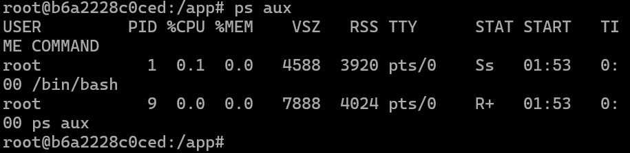
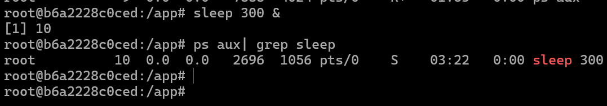
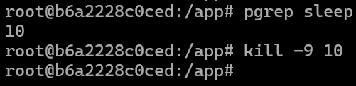
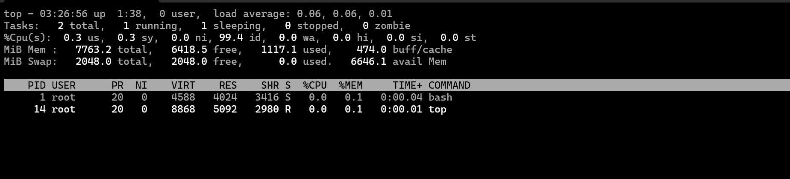
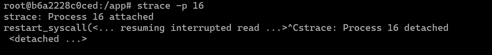
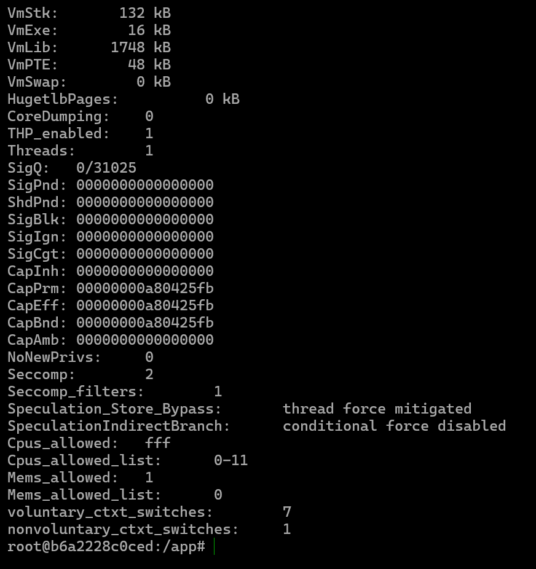
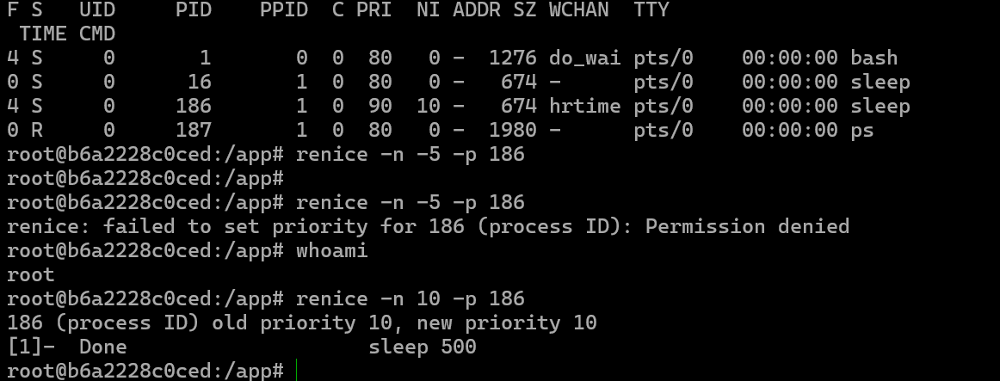
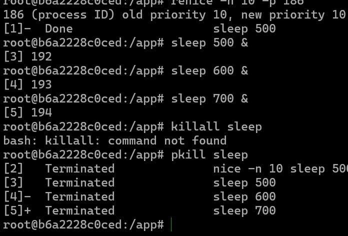
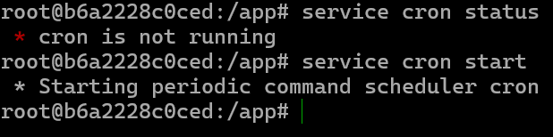

# Process
# Tugas Analisis Process

## Administrasi Jaringan

**Tugas Analisis Process**

**Nama:** Muhammad Zaidan Zhafiz Satrianto.  
**NRP:** 3123600021
**Kelas:** D4 IT A  

---

## Melihat Proses yang Berjalan



Perintah `ps aux` digunakan untuk menampilkan daftar proses yang sedang berjalan di sistem. Pada contoh di atas, terdapat dua proses aktif dalam container Linux:

- **Proses pertama (PID 1):** `/bin/bash` berperan sebagai shell utama dengan status **Ss** (sleeping, session leader). Penggunaan CPU dan memorinya sangat kecil.
- **Proses kedua (PID 9):** `ps aux` sendiri, yang berjalan untuk menampilkan daftar proses. Statusnya **R+** (running, foreground process), menunjukkan bahwa perintah ini sedang dieksekusi di terminal (`pts/0`).

Kolom **RSS (Resident Set Size)** menunjukkan penggunaan memori fisik oleh masing-masing proses.

---

## Menjalankan Proses di Latar Belakang



Perintah berikut digunakan untuk menjalankan proses di latar belakang:

```bash
sleep 300 &
```

Perintah ini menjalankan `sleep` selama **300 detik (5 menit)** tanpa mengganggu terminal. Simbol `&` memastikan shell tetap bisa digunakan untuk menjalankan perintah lain.

---

## Menghentikan Proses



Proses yang berjalan dapat dihentikan dengan perintah:

```bash
kill <PID>
```

PID (Process ID) dapat diperoleh melalui `ps aux` atau `top`.

---

## Memantau Proses Secara Real-time



Untuk melihat daftar proses secara real-time, gunakan perintah:

```bash
top
```

Perintah ini menampilkan informasi penting seperti penggunaan CPU, memori, dan status masing-masing proses.

---

## Menganalisis Proses dengan Strace



Perintah `strace` berguna untuk memantau aktivitas sistem yang dilakukan oleh suatu proses:

```bash
strace -p <PID>
```

Dengan `strace`, kita dapat melihat sistem panggilan (**syscalls**) dan sinyal yang digunakan oleh proses tertentu.

---

## Melihat Informasi Proses melalui `/proc`



Setiap proses yang berjalan memiliki direktori sendiri di `/proc`. Untuk melihat detail suatu proses, gunakan:

```bash
ls /proc/<PID>
cat /proc/<PID>/status
```

Di dalam direktori `/proc`, terdapat berbagai file yang menyimpan informasi terkait proses, termasuk penggunaan sumber daya dan statusnya.

---

## Mengubah Prioritas Proses



Prioritas proses dapat diatur menggunakan perintah `nice` dan `renice`. Contoh:

```bash
nice -n 10 <command>
renice -n -5 -p <PID>
```

- `nice` digunakan saat menjalankan proses baru dengan prioritas tertentu.
- `renice` digunakan untuk mengubah prioritas proses yang sedang berjalan.

Semakin kecil nilai **nice**, semakin tinggi prioritas proses.

---

## Menghentikan Beberapa Proses Sekaligus



Jika ada beberapa proses dengan nama yang sama, kita bisa menghentikannya sekaligus dengan:

```bash
pkill sleep
```

Perintah ini secara otomatis mencari dan menghentikan semua proses bernama `sleep`.

---

## Menjadwalkan Tugas dengan Cron



Untuk menjalankan tugas secara otomatis, kita bisa menggunakan **cron jobs**. Edit daftar cron dengan:

```bash
crontab -e
```

Misalnya, untuk menulis pesan ke dalam file log setiap menit, kita bisa menambahkan:

```bash
* * * * * echo "Log entry" >> /var/log/custom.log
```

Pastikan layanan cron berjalan dengan:

```bash
service cron start
```

Cron memungkinkan kita untuk menjadwalkan tugas secara otomatis pada interval tertentu.

