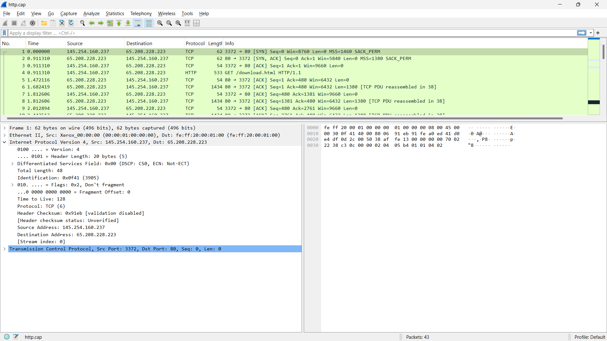
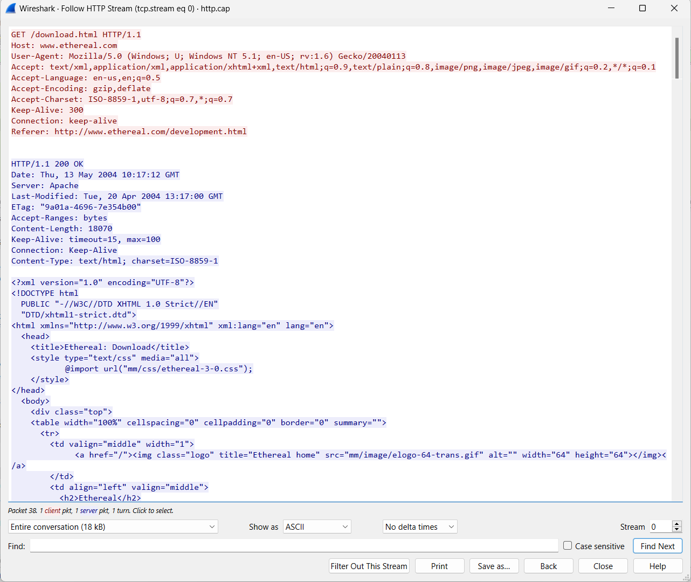
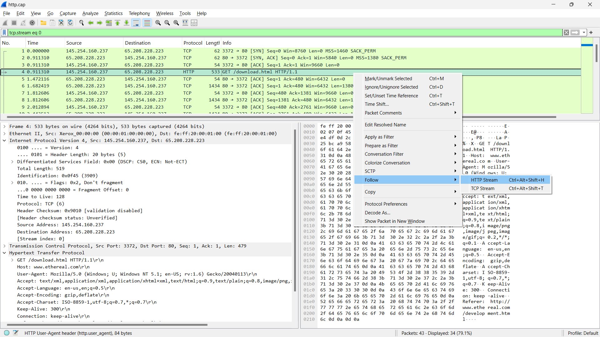
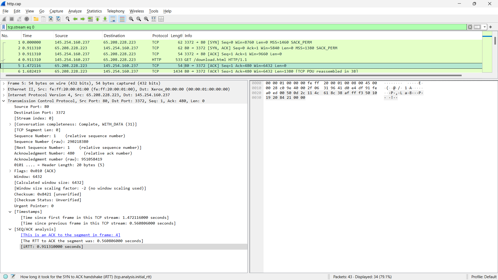
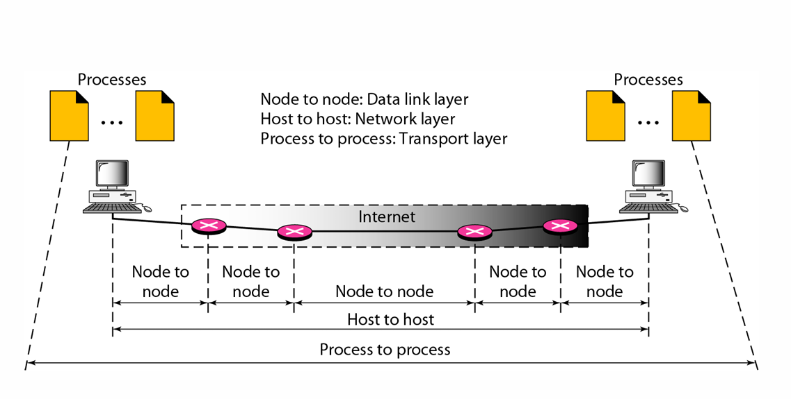

# Workshop Administrasi Jaringan

**Nama dosen pengampu:**  
Dr. Ferry Astika Saputra ST, M.Sc

**Dikerjakan oleh:**  
Nama: Muhammad Zaidan Zhafiz Satrianto
NRP: 3123600021  
Kelas: 2 D4 IT A

---

## A. Review

Eksplor `http.cap` di Wireshark, lakukan analisis:

### a. IP Server dan Client

Pilih salah satu paket, kemudian buka detail dari paket tersebut. Pilih **Internet Protocol Version**. Terdapat informasi **Source Address** dan **Destination Address**.

- **IP Server**: 65.208.228.223  
- **IP Client**: 145.254.160.237

---

### b. Versi HTTP

Pilih salah satu paket, kemudian pilih opsi **Follow**, kemudian pilih **HTTP Stream**.

Dapat dilihat dari informasi yang diberikan bahwa:  
**HTTP Version**: 1.1

---

### c. Waktu Client Mengirim Request

Pilih paket client yang mengirim HTTP request, kemudian lihat kolom **Time**.  
**Waktu client mengirim request**: 0.911310

---

### d. Waktu Server Menerima HTTP Request dari Client

Cari **acknowledge** dari HTTP request client, dapat dilihat bahwa itu terdapat di paket 5, kemudian kita lihat kolom **Time**-nya.  
**Waktu response server**: 1.472116

---

### e. Waktu yang Dibutuhkan untuk Transfer dan Response dari Client ke Server

Buka **TCP header**, kemudian lihat bagian **SEQ/ACK Analysis**. Setelah itu kita melihat **RTT**.  
**RTT**: 0.560806000

---

## B. Analisis Gambar

### a. Node to Node : Data Link Layer

1. **Node** merujuk pada perangkat dalam jaringan, seperti komputer, switch, atau router.
2. **Data Link Layer** bertanggung jawab untuk mengatur komunikasi langsung antara dua node yang terhubung dalam satu jaringan yang sama. Lapisan ini memastikan bahwa data dikirimkan dengan benar melalui media fisik, seperti kabel atau gelombang radio.
3. Lapisan ini menggunakan alamat **MAC (Media Access Control)** untuk mengidentifikasi perangkat dalam jaringan lokal.

---

### b. Host to Host : Network Layer

1. **Host** merujuk pada perangkat yang memiliki alamat IP, seperti komputer atau server.
2. **Network Layer** bertanggung jawab untuk mengatur komunikasi antara host yang mungkin berada di jaringan yang berbeda. Lapisan ini menggunakan alamat IP untuk melakukan routing paket data dari sumber menuju tujuan melalui berbagai jaringan.
3. Protokol yang umum digunakan di lapisan ini adalah **ICMP** dan **IGMP**.

---

### c. Process to Process : Transport Layer

1. **Process** merujuk pada aplikasi atau layanan yang berjalan di host, seperti browser web atau server email.
2. **Transport Layer** bertanggung jawab untuk mengatur komunikasi antara proses atau aplikasi yang berjalan di host yang sama atau berbeda. Lapisan ini memastikan bahwa data dikirimkan dengan andal dan dalam urutan yang benar.
3. Protokol yang umum digunakan di lapisan ini adalah **TCP (Transmission Control Protocol)** dan **UDP (User Datagram Protocol)**.

Ketiga lapisan ini bekerja sama untuk memastikan komunikasi yang efektif dalam jaringan. **Data Link Layer** memastikan komunikasi lokal antara node, **Network Layer** memastikan data dapat dikirim melintasi jaringan yang berbeda, dan **Transport Layer** memastikan bahwa data sampai ke aplikasi yang tepat di host tujuan.

---

## C. Resume

### Resume Tahapan TCP

#### a. Connection Establishment

Sebelum dua perangkat dapat bertukar data, mereka harus membangun koneksi TCP terlebih dahulu. Proses ini disebut **3-Way Handshake** karena melibatkan tiga langkah pertukaran paket.

**Langkah-langkah 3-Way Handshake:**

1. **SYN (Synchronize)**
   - Klien mengirimkan paket SYN ke server untuk meminta pembukaan koneksi.
   - Paket ini berisi nomor urut acak (sequence number) yang akan digunakan klien untuk mengirim data.
   - Contoh: Klien mengirim SYN dengan seq = X.

2. **SYN-ACK (Synchronize-Acknowledge)**
   - Server merespon dengan paket SYN-ACK.
   - Paket ini berisi:
     - Nomor urut acak (sequence number) yang akan digunakan server.
     - Nomor acknowledgment (ACK) yang merupakan seq klien + 1.
   - Contoh: Server mengirim SYN-ACK dengan seq = Y dan ack = X + 1.

3. **ACK (Acknowledge)**
   - Klien mengirim paket ACK ke server untuk mengonfirmasi bahwa koneksi telah terbentuk.
   - Paket ini berisi nomor acknowledgment (ACK) yang merupakan seq server + 1.
   - Contoh: Klien mengirim ACK dengan ack = Y + 1.

Setelah 3-Way Handshake selesai, koneksi TCP terbentuk, dan kedua perangkat siap untuk bertukar data.

---

#### b. Data Transfer

Setelah koneksi TCP terbentuk, kedua perangkat dapat mulai bertukar data. TCP menjamin bahwa data dikirim dengan andal, dalam urutan yang benar, dan tanpa duplikasi.

1. **Pengiriman Data**
   - Klien atau server mengirim data dalam bentuk TCP.
   - Setiap segment berisi:
     - Sequence number untuk mengidentifikasi urutan data.
     - Acknowledge Number untuk mengonfirmasi data yang telah diterima.

2. **Acknowledgement**
   - Penerima mengirim ACK untuk mengonfirmasi bahwa data telah diterima.
   - Jika pengirim tidak menerima ACK dalam waktu tertentu, data akan dikirim ulang.

3. **Flow Control**
   - TCP menggunakan mekanisme flow control untuk memastikan bahwa pengirim tidak mengirim data terlalu banyak sehingga membanjiri penerima.
   - Dilakukan dengan menggunakan window size yang merepresentasikan berapa banyak data yang dapat diterima oleh penerima.

4. **Deteksi Error dan Koneksi**
   - TCP menggunakan checksum untuk mendeteksi kesalahan dalam data.
   - Jika ada kesalahan yang terjadi, segment data akan dikirim ulang.

---

#### c. Termination

Setelah selesai bertukar data, koneksi TCP harus diakhiri atau diputus dengan benar. Proses ini kita sebut sebagai **4-Way Handshake** karena melibatkan empat langkah pertukaran paket.

1. **FIN (Finish)**
   - Salah satu perangkat (contoh, klien) mengirim paket FIN ke perangkat lain (server) untuk meminta pengakhiran koneksi.
   - Contoh: Klien mengirim FIN dengan seq = A.

2. **ACK (Acknowledge)**
   - Server merespons dengan paket ACK untuk mengonfirmasi bahwa permintaan FIN telah diterima.
   - Contoh: Server mengirim ACK dengan ack = A + 1.

3. **FIN (Finish)**
   - Server mengirim paket FIN ke klien untuk meminta pengakhiran koneksi dari sisi server.
   - Contoh: Server mengirim FIN dengan seq = B.

4. **ACK (Acknowledge)**
   - Klien merespons dengan paket ACK untuk mengonfirmasi bahwa permintaan FIN dari server telah diterima.
   - Contoh: Klien mengirim ACK dengan ack = B + 1.

Setelah 4-Way Handshake selesai, koneksi TCP ditutup, dan sumber daya jaringan dibebaskan.
